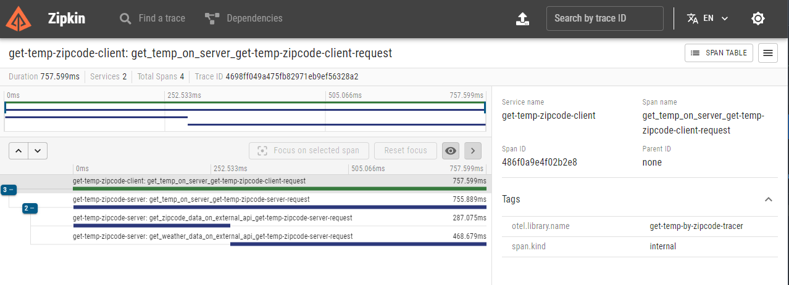

# Golang temp by zipcode

A tool for get weather of location by zipcode

## Config

```bash
go mod tidy
```

### Running

You must configure your [Weather API](https://weatherapi.com/) key on `/server/.env` file like the example `/server/.env.example`

```bash
docker compose up -d
```

The server will be running on port `:8080`
The client will be running on port `:8081`

## Usage

```bash
curl --location 'http://localhost:8081/temperature' \
--header 'Content-Type: application/json' \
--data '{
    "cep": "01153000"
}'
```

## Tracing
You can open Zipkin UI at `http://localhost:9411/` to check out application tracing.



